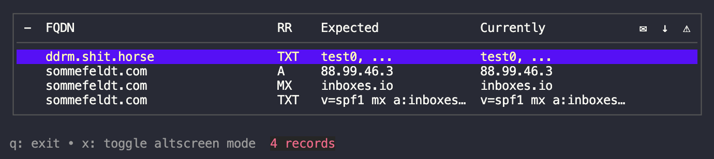
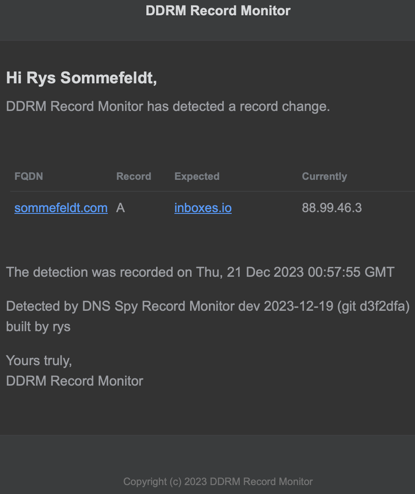

# DDRM

DDRM is a DNS record monitor written in [golang](https://go.dev/) that notifies you via email when it detects that records have changed. It's designed to be very easy to configure if you need to deviate from the sensible defaults, and easy to operate.

## How DDRM works

Through configuration, you supply DDRM with fully-qualified domain names (FQDN), resource record (RR) types, and expected values. DDRM then asks a designated DNS server for the value(s) for that FQDN+RR pair, checks them against your expected values, and emails you if anything is different.

DDRM can optionally cache record state, using Redis, so that state can persist across different executions of DDRM.

After a record change has been recorded and an email notification is sent, when using the cache, DDRM considers the changed value as the one to monitor for changes to in the future. That lets it handle the case where a record changes for some reason, and then maybe changes back to the original expected value.

It sleeps between record fetches in the configuration set, and then sleeps for a different amount of time after it has checked all records.

As it is working, you can watch the current state of processing with DDRM's terminal UI. By default the UI updates once a second, asynchronously to the processing of records. Using the UI is optional if you want to run DDRM as a headless service.



## Operating DDRM

DDRM builds into a statically linked single binary that's easy to deploy on any supported platform: just copy it to the target host machine and place it somewhere in the `$PATH`. Release binaries are pre-built for FreeBSD, Linux and macOS for both amd64 and arm64 processor architectures.

It's designed to be run in a [screen](https://www.gnu.org/software/screen/) or [tmux](https://github.com/tmux/tmux) session with its user interface running, showing you the results of the record checks, however it can also be run without the UI as a headless service.

DDRM writes log messages to `stdout` if the UI is disabled, or to `stderr` if the UI is enabled. In UI mode it's recommended that you send `stderr` somewhere useful. For example:

`ddrm-client-release-darwin-x86_64 -config ./ddrm.conf -records ./ddrm-records.conf -cache -ui 2&>>error.log`

By default, unless you pass `-insecure` when starting DDRM, it will refuse to read configuration files that aren't mode `0400` (`-r--`, read-only for the current user), because the main runtime configuration contains mailserver credentials.

## Redis as a runtime cache

It is highly recommended that you give DDRM access to a Redis database so that it can use it to memorise runtime state. That allows DDRM to keep going from the last known state if you need to restart it.

By default, keys are prefixed with `ddrm` and are [Redis sets](https://redis.io/docs/data-types/sets/) that store all of the returned query data. Sorting is performed in the DDRM client, rather than using Redis sorted sets.

Key names are in the form `<prefix>:<FQDN>:<RR type>`, for example, `ddrm:sommefeldt.com:A`.

Without the cache, DDRM won't currently update its default expected values with the results of queries.

## Terminal UI

The terminal UI (TUI) is simple and designed to show you at-a-glance information about the processing state without showing you the full information for every record.

An `x` in the first column before the FQDN indicates that the record is about to be processed again. The final three columns indicate whether an email was sent about a change, whether there was a change, or whether there was an error processing that record update.

Errors don't trigger any behaviour other than an entry in the debug log.

`-uirate` controls how often the UI updates. When the UI is active, press `x` to toggle a "fullscreen" mode that hides all other terminal text. Press `q` to exit the TUI and DDRM completely.

## Configuring DDRM

You configure DDRM by editing and securing two JSON configuration files. The first one ([`ddrm.conf`](./doc/ddrm.conf-example)) provides the main configuration that lets DDRM know how it should send email and who it should send email to, which DNS server it should use for queries, and how to talk to Redis if you're using it as a cache.

The second configuration file ([`ddrm-records.conf`](./doc/ddrm-records.conf-example)) contains the list of records you want to check, each consisting of a fully qualified domain name, a DNS resource record type, and an optional set of expected values to check against.

If you don't provide any expected values to start with, DDRM will check against the first query results returned and start from there instead.

DDRM also supports a number of command line parameters for configuring various other bits of useful runtime state away from the hopefully sensible defaults.

### [`ddrm.conf`](./doc/ddrm.conf-example) [JSON](https://json.org/) configuration values

A single JSON object containing the following members:

- `email_user`
  - `string`, username for authenticating with the configured mailserver
- `email_password`
  - `string`, password for authenticating with the configured mailserver
- `email_server_hostname`
  - `string`, hostname of the configured mailserver
- `email_server_port`
  - `string`, port number of the configured mailserver
- `email_user_name`
  - `string`, name that emails should appear to be sent from in the SMTP envelope
- `dns_server_1`
  - `string`, nameserver to query in `<hostname>:<port>` format. For example: `1.1.1.1:53`
- `dns_server_2`
  -  `string`, nameserver to query in `<hostname>:<port>` format. For example: `9.9.9.9:53`. Only used if configured and if `dns_server_1` returns an error. Leave blank to never use it.
- `email_sender_name`
  - `string`, name that appears in the body text of the email
- `email_link`
  - `string`, link that appears in clickable form at the bottom of the email
- `email_logo`
  - `string`, URL to an image to show as the logo in the email body
- `email_subject`
  - `string`, subject line of the email that is sent on a detected record change
- `redis_database`
  - `number`, integer value for the Redis database to use (defaults to `0`)
- `redis_password`
  - `string`, password to use when connecting to the Redis instance
- `redis_server`
  - `string`, Redis server to use in `<hostname>:<port>` format (defaults to `localhost:6379`)
- `redis_key_prefix`
  - `string`, prefix to use when reading and writing Redis keys (defaults to `ddrm`)

See the [`ddrm.conf`](./doc/ddrm.conf-example) example.

### [`ddrm-records.conf`](./doc/ddrm-records.conf-example) [JSON](https://json.org/) configuration values

An array of JSON objects, containing the following members.

- `fqdn`
  - `string`, fully-qualified domain name to ask for a resource record for
- `type`
  - `string`, the resource record type to ask for values for. For example, `CNAME`, `A`, or `TXT`
- `expected_values`
  - An array (`[]`) of `string` values, separated by comma (`,`) if multiple values should be checked. Multiple values are lexically sorted before comparison and so they can be defined in any order.

See the [`ddrm-records.conf`](./doc/ddrm-records.conf-example) example.

To see the full list of resource record types that DDRM knows how to interpret, please see the `ddrmRecordType` constants in [the source code](./ddrm-dns.go#15).

### Command line arguments for adjusting runtime state

```
  -4    Use IPv4 for DNS resolution (default true)
  -6    Use IPv6 for DNS resolution
  -cache
        Use Redis for persistent rolling update cache
  -config string
        Config file path (default "ddrm.conf")
  -debug
        Enabled debug mode
  -expand
        Expand tabs and quoted characters in results
  -imprecise
        Allow imprecise string matches
  -insecure
        Allow an insecure config
  -logrecords
        Log record processing results
  -plaintext
        Send plaintext email
  -quieter
        Be quieter on output
  -records string
        Records config file path (default "ddrm-records.conf")
  -sleep duration
        Seconds to sleep between checks (default 1m0s)
  -tabs int
        Number of spaces to expand tabs to (default 4)
  -tcp
        Use TCP instead of UDP for DNS resolution
  -testdns
        Test the DNS client and exit(3)
  -testemail
        Send a test email and exit(2)
  -timeout duration
        Seconds to wait for DNS client reponses before moving on (default 2s)
  -ui
        Render the terminal UI
  -uirate duration
        Seconds between UI updates (default 1s)
```

Look at [`parseCliFlags()`](./ddrm-config.go#292) in `ddrm-config.go` to see what state values are set by each flag. You can see how they're used in the codebase if you need more details.

`-imprecise` can help when a record query might return a value with a trailing `.` character, which is the correct notation for domain names in the domain name system. Using it asks the record processor to ignore it, so that you can write the config without having to remember it.

`-expand` will expand any tab characters it finds in records returned from DNS, to a specific number of spaces (default is 4, use `-tabs` to adjust that).

`-debug` is very useful if you're struggling to configure or operate DDRM. It's required to see the output of `-testdns`.

`-testdns` checks the `MX`, `A`, `SOA` and `TXT` records of `sommefeldt.com`, prints the data, and then `exit(3)`s.

## Email example

Currently DDRM supports a fixed email template that looks like this on a record change notification. Future versions might allow for more customisation of the look and feel:



## Standing on the shoulders of giants

DDRM is a composition of various excellent libraries and infrastructure software that do all of the interesting heavy lifting, allowing DDRM to focus on its value: marshalling the record checks and letting you know if anything has changed.

It uses the following great libraries and other software:

| What | Why |
| ---- | --- |
| [Bubbletea](https://github.com/charmbracelet/bubbletea) | golang Terminal UI library |
| [Lipgloss](https://github.com/charmbracelet/lipgloss) | golang Terminal UI styling |
| [Hermes](https://github.com/matcornic/hermes) | golang HTML email generator |
| [dns](https://github.com/miekg/dns) | golang DNS queries |
| [go-redis](https://github.com/redis/go-redis) | golang Redis client |
| [zerolog](https://github.com/rs/zerolog) | golang zero alloc logger |
| [go-cron](https://github.com/go-co-op/gocron) | golang cron-like asynchronous task library |
| [Redis](https://redis.io) | Optional runtime cache |

## Mini possible roadmap for new features

Future versions of DDRM _may_ do the following:

- [ ] support passing in the password credential outside of the JSON config
- [ ] allow you to detach the UI and go headless while it still operates
- [ ] allow you to reattach to a headless client (maybe with a caught signal?)
- [ ] support a Web UI
- [ ] support reconfiguration using the terminal or Web UIs
- [ ] support checking multiple DNS servers and reporting if they disagree with each other
- [ ] more email template theming
- [ ] support the runtime cached "follow along" mode without using Redis
- [ ] make `-imprecise` default to true
- [ ] collect multiple record reports into the same digest email
- [ ] report on the number of email sending errors in the TUI

## License

DDRM is [MIT licensed](./LICENSE).
 
## What does DDRM stand for?

DDRM stands for Dave's DNS Record Monitor, in honour of my good friend Dave, who mused one day that he'd love a free DNS record monitoring system.

This one is for you, Dave.